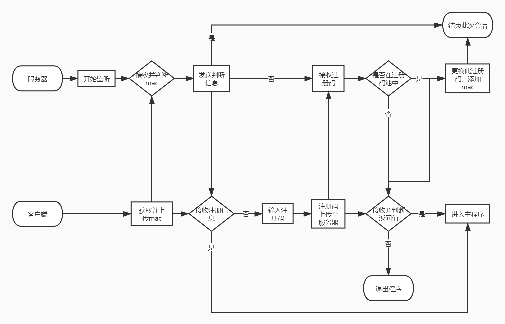

# 2种链接

有名字的: [百度](http://www.baidu.com)  
[我的域名](http://www.live4dreamch.xyz)  
[本地文件](程序.md)

没名字的:<http://www.live4dreamch.xyz>

大量网址引用时:  
[名字1][变量1]  
[名字2][变量2]  
...

[变量1]: http://www.live4dreamch.xyz
[变量2]: http://www.baidu.com

图片:  

