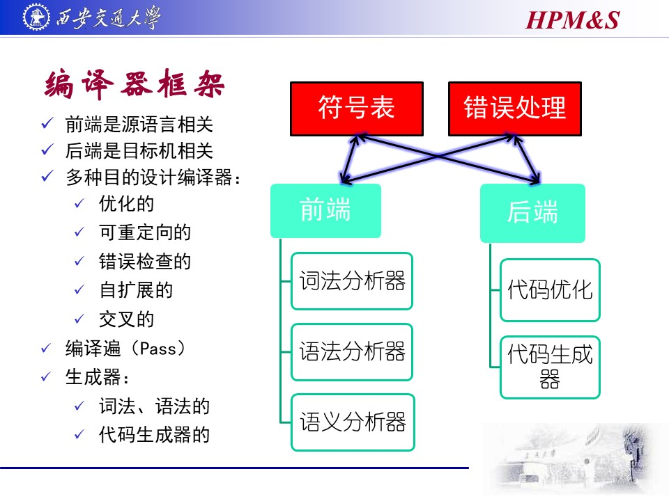

# 第一节课(导论)

## 编译

编译相关工作人员: 用编译器的"实现语言", 写一个编译器, 将"源语言"翻译成"目标语言";
编译器的用户: 将"源程序"投喂给编译器, 编译器产生"目标代码";
编译器: 用前端, 对"源程序"进行词法分析, 语法分析, 语义分析, 得到"中间代码";
        用后端, 对"中间代码"进行代码优化, 代码生成, 得到"目标代码"
机器: 运行编译器的机器叫"宿主机器", 执行"目标代码"的叫"目标机器", 而源程序没有专门对应的机器(比如你可以在任何系统下写代码)

### T型图

|S||T|
|-|-|-|
||**I**|

S – Source Language
T – Target Language
I – Implementation Language

由用I语言写的编译程序把用S语言写的源程序翻译成用T语言写的目标程序

## 编译器框架

